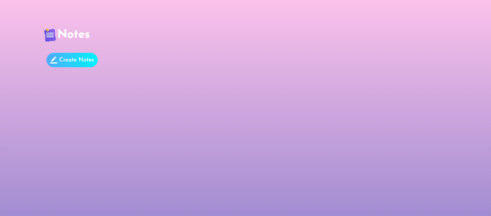
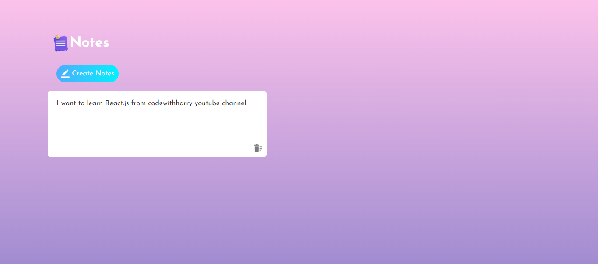

# 📝 Notes App – Simple Note Taking Website

A simple and lightweight **Note Taking Web Application** built using **HTML, CSS, and Vanilla JavaScript**.
This app allows users to create, edit, and delete notes directly in the browser.

All notes are automatically saved using **LocalStorage**, so they remain available even after refreshing the page.

---

# 🚀 Features

### 📝 Create Notes

Users can create new notes dynamically using the **Create Notes** button.

### ✏️ Edit Notes

Each note is editable directly inside the note box.

### 🗑 Delete Notes

Users can remove notes using the **delete icon** inside each note.

### 💾 Auto Save

Notes are automatically saved using **LocalStorage** so they remain after refreshing the page.

### ⚡ Lightweight & Fast

The application runs entirely in the browser without any backend.

---

# 🛠 Technologies Used

Frontend:

* HTML5
* CSS3
* Vanilla JavaScript

Browser APIs:

* LocalStorage API
* DOM Manipulation

---

# 📂 Project Structure

```
notes-taking-website
│
├── index.html
├── style.css
├── script.js
│
└── images
      ├── notes.png
      ├── edit.png
      └── delete.png
```

### index.html

Contains the main layout including:

* App title
* Create Notes button
* Notes container area for displaying notes. 

### style.css

Handles the UI design including:

* Gradient background
* Note card styling
* Buttons and layout. 

### script.js

Implements application functionality including:

* Creating notes
* Editing notes
* Deleting notes
* Saving notes in LocalStorage. 

---

# ⚙️ How It Works

### 1️⃣ Create Note

Click **Create Notes** button to add a new note.

### 2️⃣ Write Content

Type inside the note box to add or edit text.

### 3️⃣ Delete Note

Click the **delete icon** inside the note to remove it.

### 4️⃣ Automatic Saving

All notes are saved automatically using **LocalStorage**.

---

# 📥 Installation

Clone the repository:

```
git clone https://github.com/yashwanthr12/notes-taking-website.git
```

Open the project folder:

```
cd notes-taking-website
```

Run the project:

Simply open **index.html** in your browser.

No installation or server required.

---

# 🖥 Screenshots

## Notes Dashboard



## Create Notes



---

# 🔮 Future Improvements

Possible improvements for future versions:

* Dark mode
* Export notes as PDF
* Search notes feature
* Categories for notes
* Cloud storage integration
* Rich text formatting
* User authentication

---

# 📚 Learning Outcomes

This project demonstrates:

* DOM manipulation in JavaScript
* LocalStorage data persistence
* Dynamic element creation
* Event handling
* Responsive UI design

---

# 📄 License

This project is licensed under the **MIT License**.

---

# 👨‍💻 Author

**Yashwanth R**

BCA Student
Web Developer | DSA Learner | AI Enthusiast
